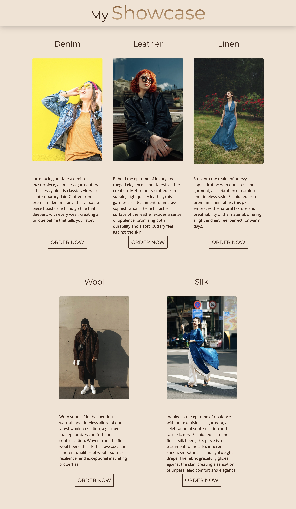

# My Showcase

Welcome to the My Showcase project! This is a simple web page that highlights various types of garments including Denim, Leather, Linen, Wool, and Silk. The page is designed with a modern, stylish aesthetic using CSS Grid and Flexbox for layout, and is responsive to different screen sizes.

## Screenshots

Here's a visual representation of how the page looks:



## Features

- **Responsive Design**: The page adjusts to different screen sizes using CSS Grid and Flexbox.
- **Stylish Header**: A fixed header with a blurred background effect.
- **Garment Sections**: Displays garments with images and descriptions.
- **Order Buttons**: Each garment section includes an "Order Now" button.

## Technologies Used

- **HTML5**: Structure of the web page.
- **CSS3**: Styling and layout of the web page.
- **Google Fonts**: Custom fonts for a modern look.

## File Structure

- `index.html`: Main HTML file containing the structure of the web page.
- `style.css`: CSS file for styling the page.

## HTML Overview

The HTML file includes:

- **Header**: Contains the main title of the page.
- **Article**: Contains sections for different types of garments, each with a title, image, description, and order button.
- **Images**: High-quality images sourced from Pexels.

## CSS Overview

The CSS file includes:

- **Root Variables**: Define colors, fonts, and font sizes used throughout the page.
- **Base Styles**: Apply box-sizing, font, and background styles to the page.
- **Header Styling**: Fixed position with a blurred background.
- **Article Styling**: Grid layout for garment sections, responsive adjustments for different screen sizes.
- **Button Styling**: Custom styles for buttons including hover effects.

## Usage

To view the showcase, open `index.html` in a web browser. The page will automatically adjust its layout based on the screen size.

## Installation

1. Clone the repository:
    ```bash
    git clone https://github.com/Kell9831/MyShowCase.git
    ```
2. Navigate to the project directory:
    ```bash
    cd my-showcase
    ```
3. Open `index.html` in your web browser.

## Contribution

Feel free to contribute by creating issues or submitting pull requests. For any changes or improvements, please follow the standard contribution process.

## License

This project is licensed under a Personal License.
